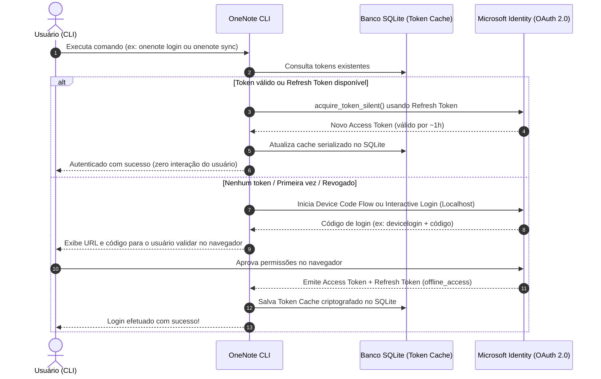

# Plano de Arquitetura e Implantação: Camada de Autenticação OneNote CLI

Este documento propõe a arquitetura de autenticação, persistência e o comando CLI inicial (`login`) para acesso às APIs do Microsoft OneNote (Microsoft Graph API), suportando contas pessoais (MSA) e corporativas/educacionais (Microsoft 365 / Entra ID).

---

## 1. Análise de Segurança & Padrão de Autenticação Microsoft

### Por que NÃO armazenar a senha do usuário:
1. **Incompatibilidade com MFA e Passkeys**: Quase todas as contas Microsoft corporativas e a maioria das contas pessoais exigem autenticação de dois fatores (MFA/2FA), Microsoft Authenticator ou autenticação sem senha (FIDO2/Windows Hello). Um login via usuário e senha direto (conhecido como fluxo ROPC) falha obrigatoriamente nesses cenários.
2. **Políticas de Segurança e OAuth 2.0**: A Microsoft proíbe e descontinua o fluxo ROPC para clientes públicos.
3. **Padrão Oficial (MSAL - Microsoft Authentication Library)**: O padrão da indústria e recomendado pela Microsoft é o uso de **OAuth 2.0 + OpenID Connect** com **Refresh Tokens**.

### Como funciona o ciclo de login transparente (Sem pedir senha novamente):


---

## 2. Estrutura de Persistência no SQLite

Em vez de salvar a senha, armazenamos o **MSAL Token Cache Serializado** (que contém o `refresh_token`, metadados de sessão, `id_token` e `access_token`).

### Esquema do Banco SQLite (`~/.onenote_cli/auth.db` ou diretório do app):
```sql
CREATE TABLE IF NOT EXISTS auth_cache (
    id TEXT PRIMARY KEY,          -- ex: 'default_account' ou user_id
    account_id TEXT,              -- Identificador único Microsoft
    username TEXT,                -- Email/UPN do usuário logado
    tenant_id TEXT,               -- Tenant ID (ou 'consumers'/'organizations')
    token_cache_blob BLOB,        -- Cache binário serializado pelo MSAL (opcionalmente encriptado)
    updated_at TIMESTAMP DEFAULT CURRENT_TIMESTAMP
);
```

### Mecanismo de Proteção (Opcional/Recomendado):
- O blob do cache pode ser criptografado com chave simétrica (`cryptography.fernet`) derivada de um segredo local da máquina antes de ser gravado no SQLite, garantindo que o banco de dados seja seguro mesmo em repouso.

---

## 3. Escopos de Permissão do OneNote

Para leitura e escrita nas notas do OneNote, os seguintes escopos do Microsoft Graph serão solicitados:
- `Notes.ReadWrite`: Permite listar cadernos, seções, páginas e criar/editar conteúdos.
- `Notes.Read`: Permite ler notas e metadados.
- `User.Read`: Para obter o perfil do usuário logado (nome, e-mail).
- `offline_access`: **Essencial** para obter o `refresh_token` que permite renovar a sessão indefinidamente sem intervenção do usuário.

---

## 4. Estrutura Proposta de Arquivos

```
busy-franklin/
├── pyproject.toml / requirements.txt   # Dependências: msal, requests, click/typer, cryptography
├── onenote/
│   ├── __init__.py
│   ├── config.py                       # Client ID, Authority, Scopes, Caminhos de DB
│   ├── auth/
│   │   ├── __init__.py
│   │   ├── sqlite_cache.py             # Implementação personalizada de MSAL SerializableTokenCache sobre SQLite
│   │   └── client.py                   # Gerenciador de autenticação (MSAL PublicClientApplication)
│   └── cli/
│       ├── __init__.py
│       └── main.py                     # CLI com comandos: login, status, logout, whoami
└── tests/
    └── test_auth.py                    # Testes unitários do cache e lógica de sessão
```

---

## 5. Fluxos de Login no CLI

Ofereceremos suporte nativo a dois modos ergonômicos de login via CLI:

1. **Device Code Flow (Padrão para CLI/Terminais)**:
   - O CLI imprime: `Para autenticar, acesse https://microsoft.com/devicelogin e digite o código: ABCD-1234`.
   - O usuário abre o link em qualquer navegador (desktop ou mobile), autentica e autoriza.
   - O CLI detecta a autorização automaticamente e salva o token no SQLite.
2. **Interactive Browser (Localhost Callback)**:
   - Abre o navegador padrão diretamente e captura o redirecionamento em uma porta local efêmera (ex: `http://localhost:8400`).

---

## 6. Configuração no Azure / Microsoft Entra

Para que a autenticação funcione, é necessário um `client_id` registrado no portal do Azure como aplicativo público (Desktop/Mobile):
- **Tipos de conta com suporte**: *Contas em qualquer diretório organizacional (qualquer diretório do Microsoft Entra ID - Multilocatário) e contas pessoais da Microsoft (por exemplo, Skype, Xbox)* -> `https://login.microsoftonline.com/common`.
- **Tipo de cliente**: Public client / Desktop application.

---

## 7. Próximos Passos & Verificação

1. **Fase 1**: Criar configuração e o adaptador de `TokenCache` com persistência em SQLite.
2. **Fase 2**: Criar a classe `OneNoteAuthenticator` com métodos:
   - `login_interactive()` / `login_device_flow()`
   - `get_valid_token()` (chamada silenciosa com fallback automático)
   - `get_current_user()`
   - `logout()` (limpeza do banco)
3. **Fase 3**: Implementar os comandos CLI (`onenote login`, `onenote status`, `onenote logout`).
4. **Fase 4**: Testes automatizados com mock da resposta do MSAL para validação de persistência no SQLite.

---

## Decisões para Aprovação

> [!NOTE]
> **Perguntas para alinhamento:**
> 1. Você já possui um `client_id` (Application ID) registrado no portal do Azure/Entra ID para este aplicativo, ou prefere que configuremos um `client_id` padrão de desenvolvimento / variável de ambiente configurável (`AZURE_CLIENT_ID`)?
> 2. Qual framework de CLI você prefere para o projeto Python (ex: `click`, `typer` ou `argparse`)?
