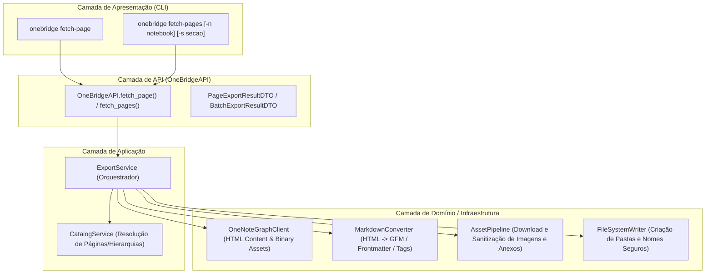

# Plano de Implantação: Comandos `fetch-page` e `fetch-pages` com Exportação Markdown

Este plano descreve a arquitetura e implementação dos comandos `fetch-page` e `fetch-pages` na ferramenta **OneBridge**, permitindo a recuperação de notas do Microsoft OneNote (por título ou ID), conversão do conteúdo XHTML/HTML para Markdown limpo (compatível com CommonMark/GFM) e download estruturado de mídias (`IMAGENS/`) e arquivos incorporados (`ANEXOS/`) dentro do diretório raiz local do projeto (`ARQUIVOS/`).

---

## 1. Visão Geral e Estrutura de Diretórios Alvo

Conforme definido em [arquitetura.md](file:///home/pbal/development/onebridge/docs/arquitetura.md), a estrutura de saída será organizada por Caderno, Seções (e Subseções/Grupos de Seções), com subpastas dedicadas para imagens e anexos:

```text
ARQUIVOS/
└── <Nome do Caderno>/
    └── [<Grupo de Seções>/.../]
        └── <Nome da Seção>/
            ├── <Título da Página>.md
            ├── IMAGENS/
            │   ├── imagem_1.png
            │   └── diagrama_2.jpg
            └── ANEXOS/
                ├── especificacao.pdf
                └── planilha.xlsx
```

A pasta raiz padrão será `./ARQUIVOS/` no diretório de execução, e será ignorada pelo `.gitignore`.

---

## 2. Componentes e Mudanças Propostas



---

## Proposed Changes

### Dependências e Configurações

#### [MODIFY] [pyproject.toml](file:///home/pbal/development/onebridge/pyproject.toml) & [requirements.txt](file:///home/pbal/development/onebridge/requirements.txt)
- Adicionar dependências: `beautifulsoup4>=4.12.0` e `markdownify>=0.13.0`.

#### [MODIFY] [.gitignore](file:///home/pbal/development/onebridge/.gitignore)
- Adicionar `/ARQUIVOS/` e `ARQUIVOS/` para evitar versionamento de notas exportadas.

#### [MODIFY] [src/onebridge/config.py](file:///home/pbal/development/onebridge/src/onebridge/config.py)
- Adicionar `DEFAULT_EXPORT_DIR = Path("ARQUIVOS")` e suporte à variável de ambiente `ONEBRIDGE_EXPORT_DIR`.

---

### Utilitários de Sistema de Arquivos

#### [NEW] [src/onebridge/utils/filesystem.py](file:///home/pbal/development/onebridge/src/onebridge/utils/filesystem.py)
- `sanitize_filename(name: str) -> str`: Remove caracteres inválidos (`/\:*?"<>|`), espaços nas extremidades e limita tamanho para compatibilidade multiplataforma (Linux, Windows, macOS).
- `sanitize_path_segment(name: str) -> str`: Normaliza nomes de pastas de cadernos e seções.
- `ensure_directory(path: Path) -> Path`: Cria pastas recursivamente de forma segura.

---

### Camada Core (Domínio & Infraestrutura)

#### [MODIFY] [src/onebridge/core/graph_client.py](file:///home/pbal/development/onebridge/src/onebridge/core/graph_client.py)
- `get_page_content(page_id: str, token: str) -> str`: Executa `GET me/onenote/pages/{page_id}/content` com os headers adequados, retornando o HTML/XHTML da nota.
- `get_binary_resource(url_or_id: str, token: str) -> bytes`: Faz download autenticado de binários de imagens e anexos da Graph API (`/resources/{id}/$value` ou URL direta com `Authorization: Bearer ...`).

#### [NEW] [src/onebridge/core/markdown_converter.py](file:///home/pbal/development/onebridge/src/onebridge/core/markdown_converter.py)
- Analisador baseado em `BeautifulSoup4` + `markdownify`:
  - **Frontmatter YAML**: Metadados estruturados (título, id, caderno, seção, datas de criação/modificação, URL original).
  - **Tags e Checkboxes OneNote**: Converte `data-tag="to-do"` para `- [ ]` e `data-tag="to-do:completed"` para `- [x]`.
  - **Tabelas**: Converte tabelas HTML para tabelas formatadas em GitHub Flavored Markdown (GFM).
  - **Destaques e Formatações**: Preserva cabeçalhos `<h1>`-`<h6>`, negrito, itálico, sublinhado, blocos de código (`<pre><code>`), links e citações.
  - **Substituição de Imagens**: Mapeia `` para caminhos relativos ``.
  - **Substituição de Anexos**: Mapeia `<object data-attachment="..." data="...">` para links clicáveis `[Nome do Arquivo.pdf](ANEXOS/Nome%20do%20Arquivo.pdf)`.

#### [NEW] [src/onebridge/core/asset_pipeline.py](file:///home/pbal/development/onebridge/src/onebridge/core/asset_pipeline.py)
- Identifica todos os elementos de imagem (``) e anexos (`<object>`) no HTML.
- Faz download via `GraphClient`.
- Salva com nomes sanitizados e únicos em `IMAGENS/` e `ANEXOS/` dentro do diretório da seção correspondente.
- Retorna o mapa de substituição para o `MarkdownConverter`.

#### [NEW] [src/onebridge/core/filesystem_writer.py](file:///home/pbal/development/onebridge/src/onebridge/core/filesystem_writer.py)
- Responsável por montar a hierarquia física no disco:
  `<root>/<Caderno>/[<Grupo de Seções>/]/<Seção>/`
- Grava os arquivos Markdown (`.md`) e cria os diretórios `IMAGENS/` e `ANEXOS/`.

---

### Camada de Serviços / Aplicação

#### [MODIFY] [src/onebridge/services/catalog_service.py](file:///home/pbal/development/onebridge/src/onebridge/services/catalog_service.py)
- Adicionar método `resolve_page(page_id_or_title: str, token: str, section_id_or_name: Optional[str] = None, notebook_id_or_name: Optional[str] = None) -> PageDTO`:
  - Permite localizar a página diretamente pelo ID ou por busca de título (exata e parcial case-insensitive), com escopo opcional na seção e caderno informados ou padrão.
- Adicionar método `get_page_hierarchy(page: PageDTO, token: str) -> tuple[NotebookDTO, SectionDTO, Optional[str]]`:
  - Resolve a linhagem hierárquica completa da página (caderno pai, seção pai e caminho de grupos de seções pai) para montagem do caminho de pastas.

#### [NEW] [src/onebridge/services/export_service.py](file:///home/pbal/development/onebridge/src/onebridge/services/export_service.py)
- `export_page(page_id_or_title: str, token: str, section: Optional[str] = None, notebook: Optional[str] = None, output_dir: Optional[Path] = None, overwrite: bool = True) -> PageExportResultDTO`:
  - Resolve a página e sua hierarquia de pastas.
  - Baixa o conteúdo HTML da página via Graph API.
  - Processa imagens e anexos via `AssetPipeline`.
  - Converte para Markdown via `MarkdownConverter`.
  - Salva o arquivo `.md` no caminho correto via `FileSystemWriter`.
- `export_pages(token: str, notebook: Optional[str] = None, section: Optional[str] = None, recursive: bool = True, output_dir: Optional[Path] = None, overwrite: bool = True, on_progress: Optional[Callable] = None) -> BatchExportResultDTO`:
  - Se especificada uma seção: exporta todas as páginas daquela seção.
  - Se especificado um caderno: varre a árvore do caderno e exporta todas as páginas de todas as seções (incluindo grupos de subseções se `recursive=True`).
  - Se nenhum parâmetro fornecido: utiliza os padrões configurados (`set-section` / `set-notebook`) ou exporta com base no contexto.

---

### Camada de API (Fronteira Pública)

#### [MODIFY] [src/onebridge/api/dto.py](file:///home/pbal/development/onebridge/src/onebridge/api/dto.py)
- Adicionar DTOs:
  - `PageExportResultDTO`: Informações sobre o arquivo salvo (caminho absoluto, caminho relativo, título, total de imagens baixadas, total de anexos baixados, tamanho em bytes).
  - `BatchExportResultDTO`: Resumo da exportação em lote (total de páginas exportadas, páginas ignoradas/com erro, lista de resultados, tempo de execução).

#### [MODIFY] [src/onebridge/api/client.py](file:///home/pbal/development/onebridge/src/onebridge/api/client.py)
- Expor métodos públicos na fachada:
  - `fetch_page(page: str, section: Optional[str] = None, notebook: Optional[str] = None, output_dir: Optional[Path] = None, overwrite: bool = True) -> PageExportResultDTO`
  - `fetch_pages(notebook: Optional[str] = None, section: Optional[str] = None, recursive: bool = True, output_dir: Optional[Path] = None, overwrite: bool = True, on_progress: Optional[Callable] = None) -> BatchExportResultDTO`

---

### Camada CLI

#### [MODIFY] [src/onebridge/cli/main.py](file:///home/pbal/development/onebridge/src/onebridge/cli/main.py)
- **Comando `fetch-page`** (e alias `fetch_page`):
  ```bash
  onebridge fetch-page "Título da Nota" [-s "Nome da Seção"] [-n "Nome do Caderno"] [-o ./ARQUIVOS] [--json]
  onebridge fetch-page 1-a2b3c4d5... [-o ./ARQUIVOS]
  ```
  - Exibe feedback amigável no terminal (título, caminho salvo, imagens e anexos baixados).
- **Comando `fetch-pages`** (e alias `fetch_pages`):
  ```bash
  onebridge fetch-pages [-n "Caderno"] [-s "Seção"] [--direct-only] [-o ./ARQUIVOS] [--json]
  ```
  - Exibe tabela ou barra de progresso com status de cada página processada e sumário final.

---

## Verification Plan

### Testes Automatizados
- **Testes de Conversão Markdown** (`tests/test_markdown_converter.py`):
  - Formatações de texto (negrito, itálico, títulos H1-H6, listas numeradas e com marcadores).
  - Checklists / To-Do tags do OneNote (`- [ ]`, `- [x]`).
  - Tabelas GFM.
  - Blocos de código.
  - Frontmatter YAML.
  - Mapeamento de tags `` e `<object data-attachment="...">`.
- **Testes de Asset Pipeline** (`tests/test_asset_pipeline.py`):
  - Download de imagens para `IMAGENS/` e anexos para `ANEXOS/`.
  - Tratamento de nomes duplicados e caracteres especiais.
- **Testes de Sistema de Arquivos** (`tests/test_filesystem.py`):
  - Sanitização de caracteres no Linux/Windows/macOS.
  - Criação correta da hierarquia Caderno / Grupo de Seções / Seção.
- **Testes do ExportService e API** (`tests/test_export_service.py`, `tests/test_api_client.py`):
  - Exportação individual e em lote com mocks da Graph API.
- **Testes da CLI** (`tests/test_cli_fetch.py`):
  - Execução dos comandos `fetch-page` e `fetch-pages` via `CliRunner`.
  - Validação de saída em tabela e JSON.
- **Execução Geral dos Testes**:
  ```bash
  uv run pytest
  ```

### Verificação Manual
- Execução de `onebridge fetch-page` e `onebridge fetch-pages` em ambiente local e verificação da estrutura gerada dentro de `./ARQUIVOS/`.
