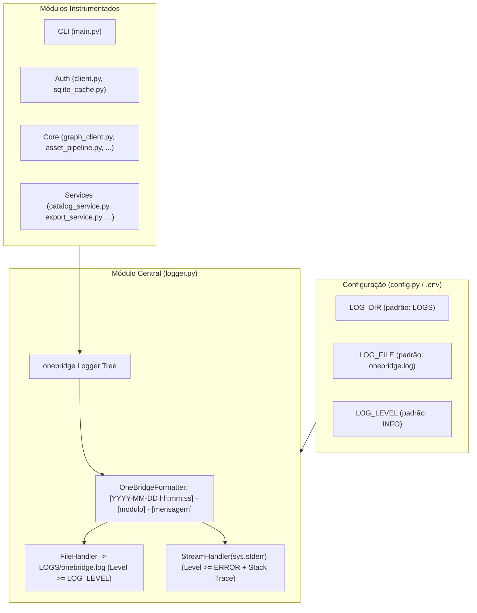

# Plano de Implantação: Sistema de Logging no OneBridge

Este plano descreve a especificação, arquitetura e implementação da funcionalidade de **Logging** centralizado no projeto **OneBridge**.

---

## 1. Visão Geral e Requisitos

1. **Diretório e Arquivo de Log**:
   - Todo log em disco é persistido em um arquivo único com nome padrão `onebridge.log` dentro do diretório `LOGS/`.
   - O diretório `LOGS/` é criado automaticamente pela aplicação caso não exista e deve fazer parte do `.gitignore`.
2. **Formato das Mensagens**:
   - As mensagens de log seguem estritamente o formato:
     ```text
     [YYYY-MM-DD hh:mm:ss] - [modulo] - [mensagem]
     ```
     Onde:
     - `YYYY-MM-DD hh:mm:ss`: Data e hora com ano, mês, dia, hora, minuto e segundo.
     - `[modulo]`: Caminho qualificado do módulo Python executado (ex: `onebridge.cli.main`, `onebridge.auth.client`).
     - `[mensagem]`: Conteúdo da mensagem de log.
3. **Níveis de Severidade**:
   - `DEBUG`: Informações detalhadas de diagnóstico (requisições HTTP, pausas de rate limiting, chaves de cache).
   - `INFO`: Notificações de operações completadas ou em andamento no sistema.
   - `WARNING`: Condições não ideais ou potenciais problemas com recuperação automática.
   - `ERROR`: Falhas críticas que impedem a conclusão de operações.
4. **Configuração**:
   - O nível padrão é `INFO`.
   - Nível, diretório e nome do arquivo são ajustáveis exclusivamente através de variáveis de ambiente ou arquivo de configuração (`.env` / `~/.onebridge/.env` / `config.py`):
     - `ONEBRIDGE_LOG_LEVEL` (default: `INFO`)
     - `ONEBRIDGE_LOG_DIR` (default: `LOGS`)
     - `ONEBRIDGE_LOG_FILE` (default: `onebridge.log`)
5. **Saída em STDERR para Mensagens de Erro**:
   - Mensagens de nível `ERROR` são gravadas no arquivo de log e simultaneamente emitidas para `sys.stderr` com o máximo de informações e stack trace (`exc_info`) quando disponível.

---

## 2. Arquitetura e Componentes



---

## 3. Detalhamento das Mudanças

### 3.1. Configuração e Governança
- **`.gitignore`**: Adição de `/LOGS/`, `LOGS/` e `*.log`.
- **`src/onebridge/config.py`**:
  - `LOG_DIR: Path = Path(os.getenv("ONEBRIDGE_LOG_DIR", "LOGS"))`
  - `LOG_FILE: str = os.getenv("ONEBRIDGE_LOG_FILE", "onebridge.log")`
  - `LOG_LEVEL: str = os.getenv("ONEBRIDGE_LOG_LEVEL", "INFO").upper()`
  - `LOG_FILE_PATH: Path = LOG_DIR / LOG_FILE`

### 3.2. Módulo Central de Logging (`src/onebridge/logger.py`)
- `OneBridgeFormatter`: Formatador customizado sem tag de nível no corpo principal (`fmt="[%(asctime)s] - [%(name)s] - [%(message)s]"` com `datefmt="%Y-%m-%d %H:%M:%S"`).
- `StderrErrorFilter`: Filtro que permite apenas registros com severidade `levelno >= logging.ERROR`.
- `setup_logging(log_level, log_file_path, force)`: Inicialização idempotente com `FileHandler` e `StreamHandler(sys.stderr)`.
- `get_logger(name)`: Fábrica de instâncias prefixadas no namespace `onebridge.*`.

### 3.3. Instrumentação das Camadas
- `src/onebridge/auth/sqlite_cache.py`: Logs de carregamento, persistência e limpeza de tokens.
- `src/onebridge/auth/client.py`: Logs de início/conclusão de Device Code Flow, Login Interativo, renovação silenciosa e erros.
- `src/onebridge/core/graph_client.py`: Logs de URLs requisitadas, status HTTP, pausas anti-throttling e erros 4xx/5xx com `exc_info`.
- `src/onebridge/services/catalog_service.py`: Logs de resolução e listagem de cadernos, seções e páginas.
- `src/onebridge/services/export_service.py`: Logs de progresso de exportação individual e em lote.
- `src/onebridge/cli/main.py`: Inicialização no grupo `cli()` e captura de exceções em comandos com `logger.error(..., exc_info=True)`.

---

## 4. Plano de Verificação

### 4.1. Testes Automatizados (`tests/test_logger.py`)
1. Resolução correta de strings de nível de log (`DEBUG`, `INFO`, `WARNING`, `ERROR`).
2. Validação regex do formato `r"^\[\d{4}-\d{2}-\d{2} \d{2}:\d{2}:\d{2}\] - \[.*\] - \[.*\]$"`.
3. Inclusão de stack trace em logs com exceção.
4. Filtro de STDERR estritamente para `ERROR`.
5. Criação automática de diretório `LOGS/` e gravação correta no arquivo.
6. Filtragem de mensagens abaixo do nível configurado.
7. Namespacing automático em `get_logger()`.

### 4.2. Verificação da Suíte Completa
- Execução do pytest garantindo regressão zero:
  ```bash
  pytest
  ```
