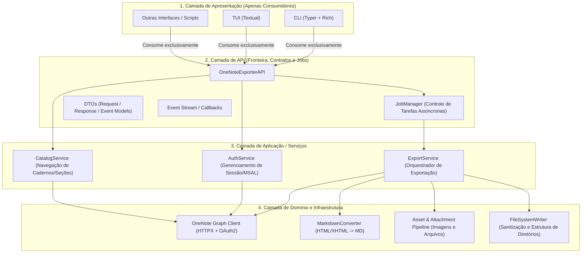
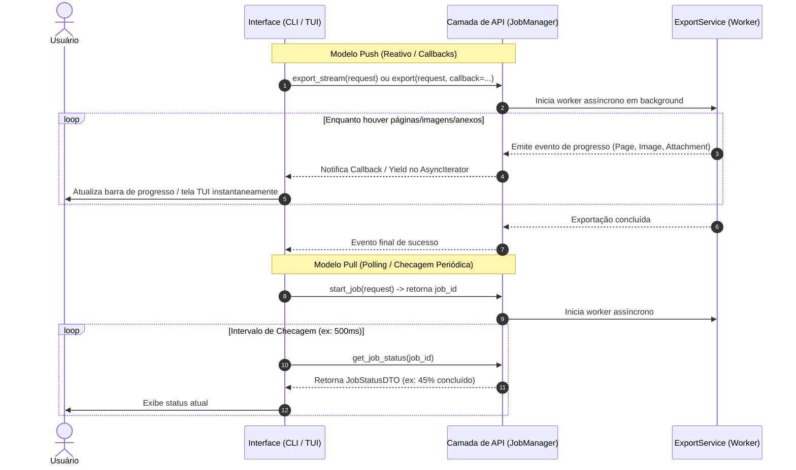

# Arquitetura do Sistema: OneNote to Markdown Exporter

Este documento consolida as decisões arquiteturais, padrões de design, fluxo de dados e a organização de código para a aplicação de exportação de notas do Microsoft OneNote para Markdown com organização hierárquica e interfaces desacopladas (CLI e TUI).

---

## 1. Visão Geral e Objetivos

O objetivo principal da aplicação é conectar-se aos cadernos do Microsoft OneNote, ler a estrutura hierárquica de cadernos, seções e páginas, converter o conteúdo das notas para Markdown e salvar os **anexos** (arquivos incorporados como PDFs, planilhas, documentos) e **imagens** em subdiretórios dedicados (`ANEXOS/` e `IMAGENS/`), mantendo a exata estrutura de organização original.

### Exemplo de Estrutura de Saída Esperada:
```text
ARQUIVOS/
└── Paulo/
    ├── Páginas/
    │   ├── Primeira Nota.md
    │   ├── Segunda Nota.md
    │   ├── IMAGENS/
    │   │   ├── foto_01.png
    │   │   └── diagrama_02.jpg
    │   └── ANEXOS/
    │       ├── especificacao_tecnica.pdf
    │       └── orcamento.xlsx
    └── Anotações/
        ├── Reunião de Planejamento.md
        ├── IMAGENS/
        │   └── print_dashboard.png
        └── ANEXOS/
            └── ata_reuniao.docx
```

---

## 2. Princípios de Design e Diretrizes Arquiteturais

1. **Clean Architecture / Separação Estrita de Responsabilidades**: O sistema é dividido em camadas concêntricas bem definidas.
2. **API como Fronteira Isoladora (API-First Boundary)**: As interfaces (CLI, TUI, scripts, APIs externas) **não** acessam diretamente os serviços internos nem o domínio. Toda comunicação ocorre exclusivamente através da **Camada de API**.
3. **Comunicação Baseada em Contratos (DTOs)**: A API expõe apenas modelos de transferência de dados (DTOs) e eventos, garantindo que alterações no backend ou nos provedores externos (ex: Microsoft Graph API) não quebrem as interfaces de usuário.
4. **Processamento Assíncrono com Dual-Mode (Push & Pull)**: Suporte tanto a streaming reativo de eventos/callbacks em tempo real (Push) quanto a verificação periódica de status sob demanda (Pull).
5. **Gerenciamento de Mídias e Arquivos (Imagens & Anexos)**:
   * **Imagens**: Salvas no diretório `IMAGENS/` da respectiva seção e referenciadas no Markdown como ``.
   * **Anexos**: Salvos no diretório `ANEXOS/` da respectiva seção e referenciados no Markdown como links clicáveis `[Nome do Arquivo.pdf](ANEXOS/Nome%20do%20Arquivo.pdf)`.
6. **Gerenciamento Moderno com `uv`**: Utilização da ferramenta `uv` para gestão de ambiente virtual, dependências e build do pacote.

---

## 3. Diagrama de Arquitetura de Camadas



---

## 4. Detalhamento das Camadas

### 4.1. Camada de Apresentação (`cli/`, `tui/`)
* **CLI (Command-Line Interface)**: Desenvolvida com `Typer` e `Rich`.
  * Comandos para autenticação (`login`, `logout`), listagem de cadernos e seções (`list`), exportação (`export`, `export-all`) e checagem de status (`status`).
  * Utiliza elementos visuais como tabelas, spinners e barras de progresso do `Rich`.
* **TUI (Terminal User Interface)**: Desenvolvida com `Textual`.
  * Navegação interativa em árvore (Cadernos ➔ Seções ➔ Páginas).
  * Seleção múltipla via caixas de seleção (checkboxes).
  * Painel de monitoramento de progresso com logs e gráficos de status em tempo real.

### 4.2. Camada de API (`api/`)
* Atua como a porta de entrada única da aplicação.
* **DTOs (Data Transfer Objects)**:
  * `NotebookDTO`, `SectionDTO`, `PageDTO`: Representações seguras das entidades.
  * `ExportRequestDTO`: Parâmetros de entrada (cadernos/seções selecionados, diretório de saída, filtros).
  * `JobStatusDTO`: Estado de uma tarefa em execução (progresso percentual, total de itens, erros).
  * `ProgressEventDTO`: Evento atômico gerado durante a execução (ex: `PAGE_STARTED`, `IMAGE_DOWNLOADED`, `ATTACHMENT_SAVED`, `PAGE_COMPLETED`).
* **`JobManager`**:
  * Gerencia o ciclo de vida das tarefas assíncronas em background.
  * Mantém histórico de progresso e roteia notificações para os inscritos.

### 4.3. Camada de Serviços / Aplicação (`services/`)
* **`AuthService`**: Controla o fluxo de autenticação OAuth2 (Device Code Flow / Interactive Browser) com cache local seguro de tokens.
* **`CatalogService`**: Obtém a estrutura hierárquica de cadernos, grupos de seções e seções do usuário.
* **`ExportService`**: Orquestra a execução da exportação, coordenando leitura, conversão, download de mídias/anexos e persistência em disco.

### 4.4. Camada de Domínio / Infraestrutura (`core/`)
* **`GraphClient`**: Cliente HTTP assíncrono para comunicação com a Microsoft Graph API (`https://graph.microsoft.com/v1.0/me/onenote/`).
* **`MarkdownConverter`**: Analisador semântico de HTML/XHTML do OneNote (`BeautifulSoup4` + `markdownify`). Converte:
  * Formatação rica, cabeçalhos, destaques e blocos de código.
  * Tabelas formatadas em Markdown compatível com GitHub/CommonMark.
  * Listas de tarefas com caixas de seleção (`- [ ]`, `- [x]`).
  * Links de anexos (`<object data-attachment="..." data="...">`) convertidos para links locais `[arquivo.ext](ANEXOS/arquivo.ext)`.
  * Imagens (``) convertidas para tags ``.
* **`AssetPipeline`**: Identifica tags de imagem e tags de anexos incorporados nas notas, baixa os binários de forma autenticada via Graph API, salva-os nas subpastas correspondentes (`IMAGENS/` ou `ANEXOS/`) e assegura nomes de arquivos únicos e válidos.
* **`FileSystemWriter`**: Cria a hierarquia de pastas da seção e dos subdiretórios `IMAGENS/` e `ANEXOS/`, validando e sanitizando caminhos no disco para compatibilidade multiplataforma (Linux, Windows, macOS).

---

## 5. Modelos de Comunicação Assíncrona e Progresso

Para atender às necessidades de interfaces ricas (TUI) e scripts/terminais convencionais (CLI), a API oferece dois mecanismos complementares:



---

## 6. Estrutura do Projeto no Código-Fonte

Organização modular recomendada utilizando o padrão `src/`:

```text
.
├── pyproject.toml              # Metadados do projeto, dependências e entrypoints (uv)
├── uv.lock                     # Lockfile determinístico do uv
├── .env.example                # Configurações de ambiente (Client ID, escopos)
├── README.md                   # Instruções de uso e instalação
├── tests/                      # Bateria de testes unitários e de integração
│   ├── test_api/
│   ├── test_converter/
│   ├── test_exporter/
│   └── test_cli/
└── src/
    └── onenote_exporter/
        ├── __init__.py
        ├── config.py           # Configurações gerais (diretórios padrão, timeouts)
        │
        ├── api/                # === Camada de API (Fronteira Pública) ===
        │   ├── __init__.py
        │   ├── client.py       # Ponto de acesso principal para as UIs
        │   ├── dto.py          # Modelos de dados (Pydantic DTOs)
        │   ├── events.py       # Definições de eventos de progresso
        │   └── job_manager.py  # Gestão de tarefas em background
        │
        ├── cli/                # === Interface CLI (Typer) ===
        │   ├── __init__.py
        │   └── main.py         # Entrypoint da CLI
        │
        ├── tui/                # === Interface TUI (Textual) ===
        │   ├── __init__.py
        │   ├── app.py          # Entrypoint da TUI
        │   ├── screens/        # Telas (Navegação, Progresso, Login)
        │   └── widgets/        # Widgets customizados
        │
        ├── services/           # === Camada de Serviços / Aplicação ===
        │   ├── __init__.py
        │   ├── auth_service.py
        │   ├── catalog_service.py
        │   └── export_service.py
        │
        ├── core/               # === Camada de Domínio / Infraestrutura ===
        │   ├── __init__.py
        │   ├── graph_client.py
        │   ├── markdown_converter.py
        │   ├── asset_pipeline.py # Processamento de Imagens e Anexos
        │   └── filesystem_writer.py
        │
        └── utils/              # === Utilitários Gerais ===
            ├── __init__.py
            ├── filesystem.py   # Sanitização de caminhos e nomes de arquivos
            └── logging.py      # Configuração de logs estruturados
```

---

## 7. Stack Tecnológica e Ferramentas

| Categoria | Tecnologia / Biblioteca | Finalidade |
| :--- | :--- | :--- |
| **Linguagem & Runtime** | Python 3.11+ | Suporte nativo completo a `asyncio` e tipagem estrita |
| **Gerenciador de Pacotes** | `uv` | Resolução ultrarrápida de dependências e gestão de virtualenvs |
| **Interface CLI** | `typer` + `rich` | Comandos amigáveis e formatação visual avançada no terminal |
| **Interface TUI** | `textual` | Interface de terminal interativa com componentes visuais reativos |
| **Autenticação** | `msal` | Microsoft Authentication Library (OAuth2 Device Code Flow) |
| **Cliente HTTP** | `httpx` | Chamadas assíncronas de alto desempenho à Graph API |
| **Modelagem & Validação** | `pydantic` | DTOs tipados e validação rigorosa de dados |
| **Parsing & Conversão** | `beautifulsoup4` + `markdownify` | Processamento do XHTML das páginas e conversão limpa para Markdown |
| **Testes** | `pytest` + `pytest-asyncio` + `respx` | Testes automatizados assíncronos com mock de requisições HTTP |
